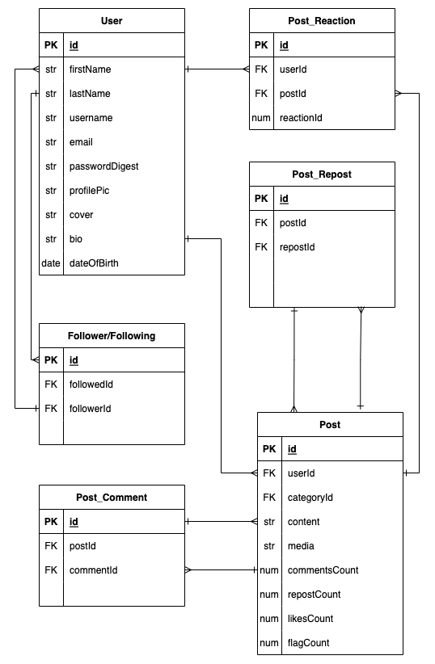

# BeesKnees Backend

## Date: 12/7/2022

### By: Kalen Luciano: [GitHub](https://github.com/kalenluciano) | [LinkedIn](https://www.linkedin.com/in/kalenluciano/)

#### [BeeKnees Frontend](https://github.com/kalenluciano/beesknees-frontend)

####[Deployed Site]()

---

### **_Description_**

This app allows users to post content, follow other users, and interact with other users' posts. Join the hive.

---

### **_Getting Started_**

- `Fork` and `clone`
- `cd` into the directory
- Run `sequelize db:create`
- Run `sequelize db:migrate`
- Run `sequelize db:seed:all`
- Run `npm run dev`

A Trello board was used to keep track of development progress and can be viewed [here](https://trello.com/b/2omo5oFi/beesknees).

---

### **_Technologies_**

- PostgreSQL
- Sequelize
- Express.js
- Node.js
- JavaScript

**_Entity Relationship Diagram:_**

## 

---

### **_Screenshots_**

#### Image 1 Header

---

### **_Future Updates_**

- [ ] TBD

---

### **_Credits_**

TBD
