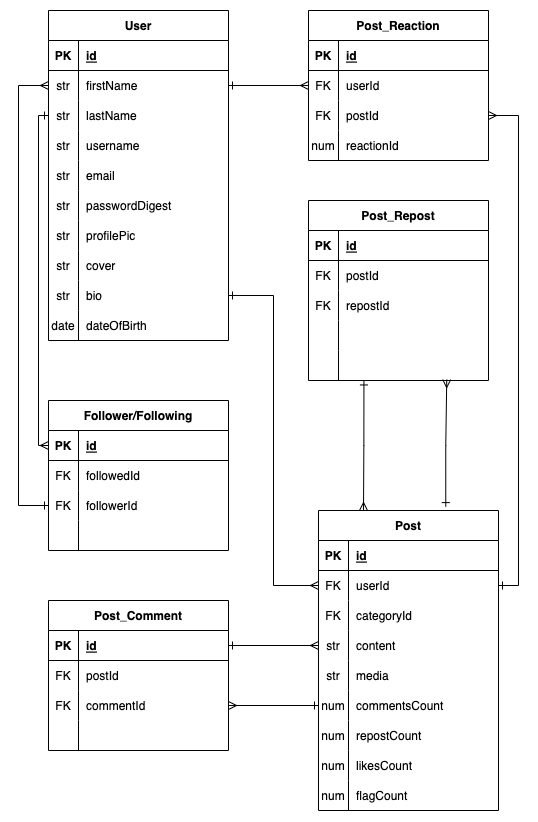

# BeesKnees Backend

## Date: 12/7/2022

### By: Kalen Luciano: [GitHub](https://github.com/kalenluciano) | [LinkedIn](https://www.linkedin.com/in/kalenluciano/)

#### [BeeKnees Frontend](https://github.com/kalenluciano/bees-knees-frontend)

#### [Deployed Site](http://bees-knees-frontend.herokuapp.com)

---

### **_Description_**

This app allows users to post content, follow other users, and interact with other users' posts. Join the hive.

---

### **_Getting Started_**

-   `Fork` and `clone`
-   `cd` into the directory
-   Run `sequelize db:create`
-   Run `sequelize db:migrate`
-   Run `sequelize db:seed:all`
-   Run `npm run dev`

A Trello board was used to keep track of development progress and can be viewed [here](https://trello.com/b/2omo5oFi/beesknees).

---

### **_Technologies_**

-   PostgreSQL
-   Sequelize
-   Express.js
-   Node.js
-   JavaScript

**_Entity Relationship Diagram:_**

## 

---

### **_Future Updates_**

-   [ ] Add a relation to track posts viewed by user and filter/sort posts to send to a user based on viewed content
-   [ ] Add in verified users and give more weight to reactions by verified users on posts about a specific topic
